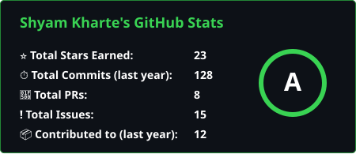
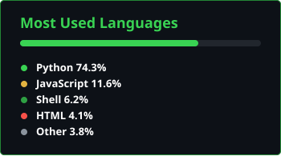

# Hi there, I'm Shyam! 👋 🧑‍💻

  

---

### 🚀 About Me
- 🤖 Founder & Lead Architect of **Star AI** (Autonomous WhatsApp Interface)
- 🎒 12th Commerce Student at Dr. Babasaheb Ambedkar College, Pune
- 🛡️ Cybersecurity Researcher focused on Vulnerability Research & Threat Mitigation
- ⚙️ Systems: Arch Linux, Termux, Git

---

### 🛠️ Tech Stack & Tools

  
  
  
  
  

---

### 📊 My GitHub Stats

  
  

---

### 📬 Connect with Me

  
  
  

<i>"Creating a world from zero."</i>

